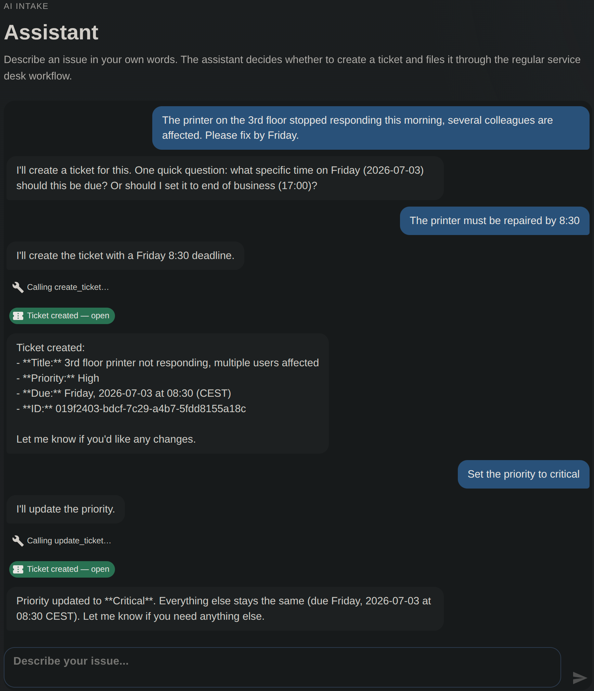
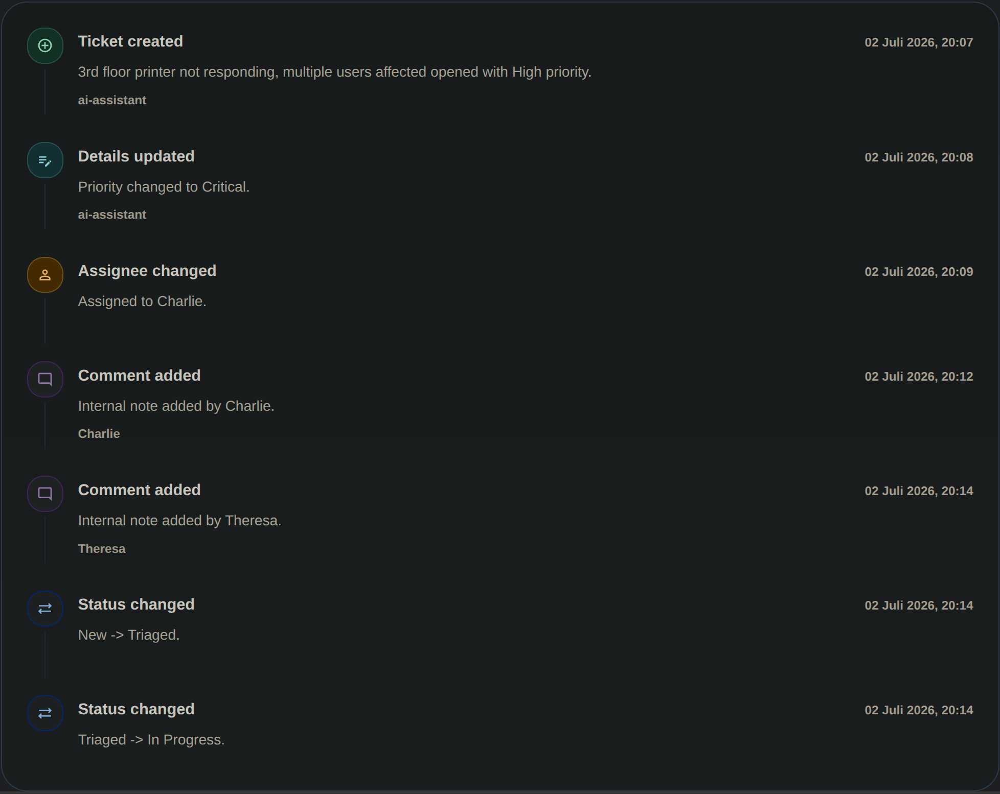

ServiceDeskLite gained an intake assistant: the user describes their problem in free text, a Claude model decides via tool calling whether to create a ticket or correct an existing one, and the answer appears in the browser token by token. Taken by itself, a manageable feature. It becomes interesting where it touches the architecture: an external service whose answers aren't predictable is supposed to be allowed to change domain state - and its output arrives as a stream that should reach the client with as little delay as possible.

The question the ADR answers is therefore less "how do you build this" than "where does something like this belong".

## Three candidates

The obvious place would be an application port: `IAssistantService`, implemented in Infrastructure, symmetrical to persistence. The pattern is familiar, and for persistence it works well. Here, though, the symmetry doesn't quite hold: a repository encapsulates something several use cases need. The assistant has exactly one consumer - the endpoint that exposes it. Streaming adds to that: SSE framing and the assembly of partial answers would have to be passed through the abstraction, which would make it wider rather than cleaner.

A separate service next door would be the other direction - cleanly separated, but a second deployment for a single endpoint. Hard to justify in a reference project.

That leaves the third option: an edge adapter in the API project. The LLM orchestration lives next to the endpoint that makes it visible. The reasoning is the same one the project used when it passed on MediatR: an abstraction with a single consumer brings its costs immediately and its benefits only once a second one arrives. The path there stays open.

## The way into the domain

How does the model reach the domain? The same way everyone else does: the tools the model can call in turn call the existing command handlers - the same ones behind the REST endpoints. There is no special path.

That sounds unspectacular, but it carries far. Every AI-created ticket passes the same validation, lands in the same audit trail and the same outbox staging as a hand-created one - without anything being built twice. The question of whether the business rules also apply to the AI no longer comes up; there is simply no path on which they could be bypassed.

Domain and Application compile without any Anthropic reference. If the feature were dropped again, one folder, one endpoint group, and one DI call would have to be removed.

## Tool calls are input

A tool call from the model is structurally the same thing as an HTTP request from outside: JSON that should contain valid arguments - but doesn't have to. So it's treated accordingly: parsed and checked before it reaches a handler. Is the shape right, are the enum values known, is the due date in the future.

On rejection, the error goes back to the model as a tool result, and the model can make a corrected attempt within the same conversation. The check becomes a feedback loop: the model gets the chance to correct itself instead of a bad value quietly landing in the system. The loop has a fixed upper bound on iterations - for the case where one attempt looks just like the next.

A pleasant side effect: parsing and checking are functions without side effects. They're covered by ordinary unit tests, without an API key and without a network.

## Streaming stays presentation

Two things lie interleaved in the model's answer: text that should reach the browser immediately, and tool arguments that arrive as JSON fragments and are only complete at the end of a block. One could build two processing paths out of that. One is enough: text is forwarded the moment it arrives, tool JSON is collected per block and parsed at block end - a single pass for both.

That all of this lives in the API layer is the placement decision followed through: token delivery and SSE framing are presentation concerns. An application layer that has to know what a server-sent event is would already have given up the separation.

A detail on the side: the API holds no conversation state. Every turn resends the full transcript; per request, the server contributes only the current date including the weekday and the user's timezone. It looks small, but it decides whether "by Friday morning" lands on the right day - a model without a calendar can only guess.

## What's deliberately missing

No application port as long as there is no second consumer. No conversation persistence - transcripts live in the browser session. No generic tool plugin mechanism - with two tools, two explicit classes are easier to read than a registry. Each of these could be added later; none of them would improve anything today.

## When to reconsider

Three triggers are recorded in the ADR. A second consumer of the assistant - a bot, a background job - would be the point at which the application port earns its keep. If conversations are to continue across sessions, state moves to the server, and the contract changes with it. And if the number of tools grows beyond a handful, the registry mechanism that would only be effort today starts to pay off.

Until then, the line all sub-decisions pay into remains: the model stays outside the architecture. That doesn't make the assistant smarter - but it ensures that its mistakes end as rejected requests, not as corrupted state.
