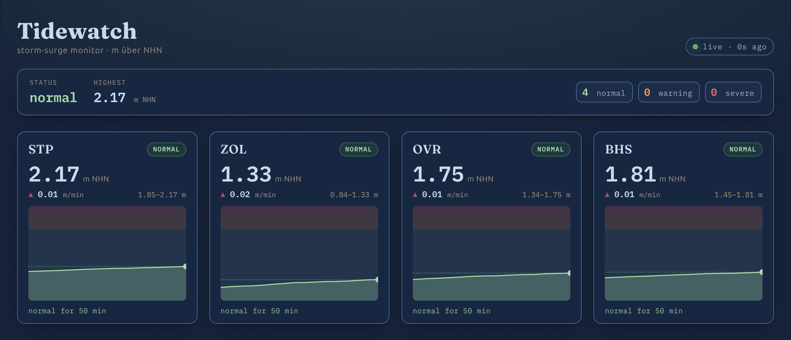

## Was es ist

port-tidewatch ist ein fokussierter Ingestion-Service für Pegelstand-Telemetrie von Häfen mit automatischem Sturmflut-Alerting. Das System ist an Hamburgs WADI-Warnsystem angelehnt und schlägt Alarm, wenn der erwartete Scheitelwert einer Sturmflut **4,50 m über NHN** (bzw. 2,40 m über MThw) übersteigt.



*Live-Dashboard auf **echten WSV/PEGELONLINE-Daten** - die öffentlichen Hamburger Elbe-Pegel (St. Pauli, Zollenspieker, Over, Bunthaus), alle `normal` (reale Pegel liegen weit unter den Sturmflut-Schwellen).*

Der Datenfluss ist bewusst geradlinig: **Reading-Source → Ingestion-Service → Dashboard**. Eine Reading-Quelle - wahlweise der Simulator (scripted Surge) oder der echte PEGELONLINE-Elbe-Feed, per `ReadingSource`-Switch beim Start gewählt - emittiert Pegel-Readings für mehrere Messstellen über RabbitMQ. Der Ingestion-Service konsumiert sie, evaluiert jedes Reading gegen den Threshold, hält per-Gauge State und leitet Alarmzustände ab. Die Evaluation ist gestuft mit drei Stufen - **normal / warning (4,50 m) / severe (5,50 m)** - und trend-aware mit Hysterese, um falsche Eskalationen zu vermeiden. Poison Messages werden in eine Dead-Letter-Queue geroutet, statt die Pipeline zu blockieren. Ein read-only Angular Dashboard zeigt aktuelle Pegel, den Alarmstatus pro Messstelle und historische Trends als banded Area-Charts.

```
┌─────────────────────────────┐    readings     ┌──────────────────┐  alerts / state    ┌─────────────┐
│ reading-source host (.NET)  │ ──────────────▶ │ ingestion service│ ─────────────────▶ │  dashboard  │
│ one source, set by config:  │    RabbitMQ     │      (.NET)      │   REST (polling)   │  (Angular)  │
│  • simulator (scripted)     │                 └──────────────────┘                    └─────────────┘
│  • PEGELONLINE Elbe feed    │                           │
└─────────────────────────────┘                           │ poison messages
        ReadingSource switch                              ▼
                                                ┌──────────────────┐
                                                │ dead-letter queue│
                                                └──────────────────┘
```

## Problem / Motivation

Ich wollte eine Ingestion-Pipeline, die ich end-to-end reliable und observable bekomme - ohne mich in Breite zu verlieren. Statt eines generalisierten Systems habe ich den Scope hart eingegrenzt: eine Domain, ein Ingestion-Pfad, keine Write-Operationen aus dem UI. Die interessanten Probleme liegen hier nicht in der Feature-Menge, sondern darin, eine Message-getriebene Pipeline so zu bauen, dass Failure-Modes - Poison Messages, Consumer-Restarts, partielle Verfügbarkeit - sauber gehandhabt werden und im Tracing sichtbar bleiben.

## Architecture / Wichtige Entscheidungen

Die Threshold-Evaluation passiert **im Ingestion-Service selbst**, nicht downstream im Dashboard. Das Dashboard bleibt damit reiner Read-Path über den abgeleiteten State; die Alarm-Logik hat einen einzigen, testbaren Ort.

Transport ist RabbitMQ mit Dead-Letter-Exchange. Messages, die das Processing nicht bestehen, werden isoliert statt die Queue zu blockieren - die Pipeline bleibt verfügbar, fehlerhafte Readings landen nachvollziehbar im DLQ.

Per-Gauge State wird im Service gehalten, sodass der Alarmzustand pro Messstelle unabhängig fortgeschrieben wird. Der Surge-Evaluator-Algorithmus bestimmt die Alarmstufen aus den eingehenden Readings.

Vier ADRs dokumentieren die zentralen Entscheidungen: Ort der Threshold-Evaluation (service-side), Struktur des Dashboard-State, Wahl der Container-Plattform und der Surge-Evaluator-Algorithmus. Der Anspruch: das Reasoning ist sichtbar, nicht nur das Ergebnis.

Für das Deployment fällt die Wahl bewusst auf **Kubernetes + Argo CD (GitOps)** statt nur Azure Container Apps - wegen des declarative Infrastructure-as-Code-Workflows und der Sichtbarkeit, die er verschafft. Beide Pfade sind in v1.0.0 verifiziert: Kubernetes + Argo CD als primärer GitOps-Weg, Azure Container Apps + Static Web Apps als Cloud-Alternative.

Alle Architekturentscheidungen sind als ADRs dokumentiert: [`docs/adrs/`](https://github.com/goldbarth/port-tidewatch/tree/main/docs/adrs).

→ [Surge Evaluator: sechs Entscheidungen, eine Richtung](/decisions/surge-evaluator-decisions)

## Roadmap

Das Projekt ist in Milestones strukturiert, jeder als kohärenter Zwischenzustand gedacht - das Repo bleibt über alle Phasen funktionsfähig.

| Phase     | Ziel                                                                   | Status                                                       |
|-----------|------------------------------------------------------------------------|--------------------------------------------------------------|
| M1        | Repo-Struktur, Data Contracts, Threshold-Config                        | <span style="color:oklch(0.55 0.09 75)">abgeschlossen</span> |
| M2        | RabbitMQ-Integration, Consumer-Logik, per-Gauge State                  | <span style="color:oklch(0.55 0.09 75)">abgeschlossen</span> |
| M3        | OpenTelemetry Tracing, Integration-Tests via Testcontainers            | <span style="color:oklch(0.55 0.09 75)">abgeschlossen</span> |
| M4        | Angular Dashboard (read-only: Pegel, Status, Trends)                   | <span style="color:oklch(0.55 0.09 75)">abgeschlossen</span> |
| M5        | Deployment: Azure Container Apps → Kubernetes + Argo CD                | <span style="color:oklch(0.55 0.09 75)">abgeschlossen</span> |
| M6 (v1.1) | Sturmflut-Szenarien, Dashboard-Politur, Alert-Event-Publishing         | <span style="color:oklch(0.55 0.09 75)">abgeschlossen</span> |
| M7 (v1.2) | Echter PEGELONLINE-Elbe-Feed, umschaltbare Datenquelle (Source-Switch) | <span style="color:oklch(0.55 0.09 75)">abgeschlossen</span> |
| M8        | Observability-Pfad im Dashboard sichtbar machen                        | <span style="color:oklch(0.55 0.02 75)">verworfen (Revert)</span> |
| M9 (v1.3.0) | Readability: Messwert-Alter statt Poll-Alter, ankunftsbasierte Frische, Header-Uhr | <span style="color:oklch(0.55 0.09 75)">abgeschlossen</span> |

## Stand

**[v1.3.0](https://github.com/goldbarth/port-tidewatch/releases/tag/v1.3.0) ist da** (16.06.2026) - Milestones M1–M7 und M9 abgeschlossen (M8 verworfen).

Die Basis kam mit [v1.0.0](https://github.com/goldbarth/port-tidewatch/releases/tag/v1.0.0) (11.06.2026, M1–M5): Die Pipeline läuft end-to-end - Simulator → RabbitMQ → Ingestion → State → Dashboard. Gestufte Surge-Evaluation (normal / warning / severe) mit Hysterese, OpenTelemetry-Tracing mit W3C-Context-Propagation über das ganze System, HTTP-API für Gauge-Snapshots und Health-Checks. Unit-Tests für die Evaluation-Logik, Testcontainers-Integration-Tests gegen echtes RabbitMQ. Zwei verifizierte Deployment-Pfade: Kubernetes + Argo CD (GitOps) und Azure Container Apps + Static Web Apps.

v1.1.0 (M6) bringt die Demo-Reife: Der Simulator nutzt jetzt ein Composite-Level-Modell (Baseline + Tide + scripted Surge + Rauschen), parametrierbar über `SURGE_PEAK_M` und `SURGE_PERIOD_S` - eine Messstelle (`CUX`) durchläuft die volle Alarm-Kaskade, die anderen bleiben normal. Das Angular Dashboard ist überarbeitet: banded Area-Charts auf fixer 0–6-m-Skala mit Threshold-Markern, Header-Summary, relative Time-in-Stage ("warning seit 3 min"), live/stale/offline-Indikatoren und animierte Stage-Übergänge. Das `GaugeDto` liefert nun Rate-of-Change (m/min), Time-in-Stage und Fenster-Min/Max, die als Trend-Pfeile im UI erscheinen. Neu außerdem ein `AlertEvent`-Contract: bei jedem Stage-Wechsel wird aus einem zentralen Chokepoint über einen RabbitMQ-Fanout-Exchange in eine durable Audit-Queue publiziert (initiale Stage-Etablierung unterdrückt, um spurious Events zu vermeiden). Dazu eine ~60-Sekunden-Demo des Sturmflut-Szenarios.

v1.2.0 (M7) bringt echte Daten: Ein PEGELONLINE-Source-Adapter pollt die öffentliche WSV-REST-API für vier Hamburger Elbe-Pegel (St. Pauli, Bunthaus, Over, Zollenspieker) und emittiert dieselben `Reading`-Records wie der Simulator - Centimeter über Pegelnull werden in einem expliziten Mapping-Layer nach Meter NHN umgerechnet (W/100 + PNP-Offset), conditional GET (`If-None-Match`) verhindert Duplikate bei `304`, transiente API-Fehler werden geloggt und retried. Welche Quelle läuft, entscheidet ein einzelner `ReadingSource`-Switch (`Simulator | Pegelonline`) beim Start - fail-fast bei ungültiger Konfiguration. Das frühere Simulator-Projekt wurde dafür zum quellen-neutralen `Tidewatch.Source`-Host (Quellen hinter `IReadingSource`). Deployed (Kubernetes + Azure) läuft der Live-Feed, lokal bleibt der Simulator die dokumentierte Demo.

v1.3.0 (M9) macht die angezeigten Werte ehrlich lesbar - Readability statt der ursprünglich geplanten Observability-Oberfläche (M8 wurde verworfen, der OpenTelemetry-Pfad bleibt verdrahtet, aber unsichtbar; siehe ADR-003-Amendment). Die Frische-Anzeige zeigt jetzt das Alter des **Messwerts** (`Reading.Timestamp`) statt des letzten Polls - bei PEGELONLINE mit seiner mehrminütigen Publikations-Latenz war ein frischer Poll auf einen alten Messwert vorher fälschlich „live". Der **Stale-Zustand koppelt an den Daten-Zufluss, nicht ans Messwert-Alter**: eine Kachel wird erst orange, wenn *keine neuen* Werte mehr ankommen - gemessen ab der Ankunftszeit, gegen eine aus der inferierten Quell-Cadence abgeleitete Schwelle (`2× cadence`, mit Untergrenze für das Poll-Intervall). So bekommen Simulator (Sekunden) und PEGELONLINE (Minuten) automatisch die passende Schwelle, nichts ist hartkodiert. Dazu eine mitlaufende **Header-Uhr** (`HH:MM:SS`, Europe/Berlin) als Zeitanker und ein Fix, der das Dashboard auf einem frischen Clone lokal lauffähig macht (unaufgelöster `config.json`-Deploy-Platzhalter → same-origin `/api`).

Als Nächstes: die Roadmap jenseits M9 ist offen - der Kern (Pipeline, echte Daten, beide Deploy-Pfade, lesbare Frische) steht.
